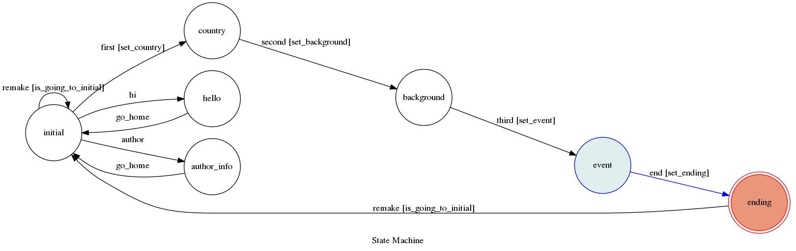

# TOC Project 2019

## 人生首抽機(chatbot)
* 不滿意你的人生嗎？那就來刷刷首抽吧～
### 簡述
* 人生不能重來，但人生首抽機可以
* 步驟：抽國家->抽家庭背景->情境選擇->結局
* 不滿意怎麼辦>_<？
	-	remake就行囉
### Finite State Machine

### 操作說明

* 起始點（initial）
	-	輸入start（開始），hi（打招呼），author（看作者資訊）
* 根據提示按下按鈕（country, background），抽國家、抽家庭背景
* 情境選擇（event）：按下你決定的方向
* 結局（ending）：每個結局都不同
	-	輸入 remake，可以再來一次
### 開發環境
* python3.6.7

### deploy
* 使用Heroku
	-	https://dashboard.heroku.com/apps

### Reference
[TOC-Project-2017](https://github.com/Lee-W/TOC-Project-2017) ❤️ [@Lee-W](https://github.com/Lee-W)
